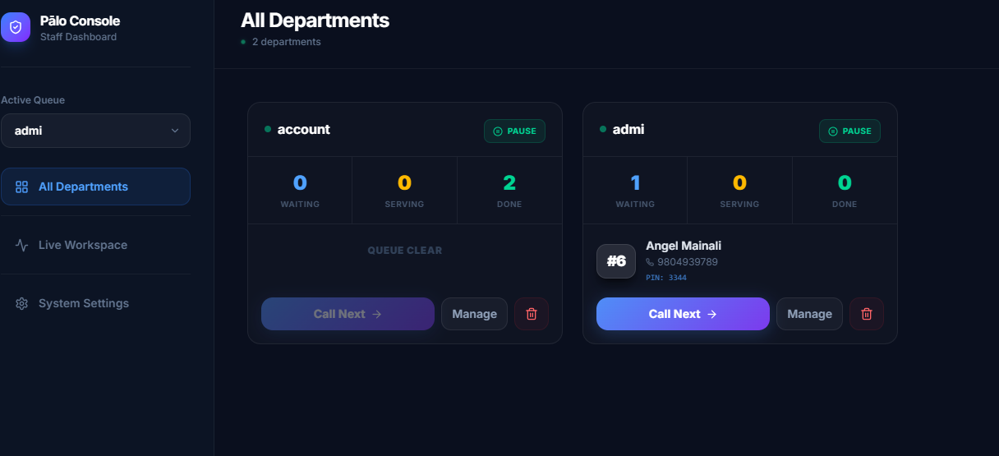
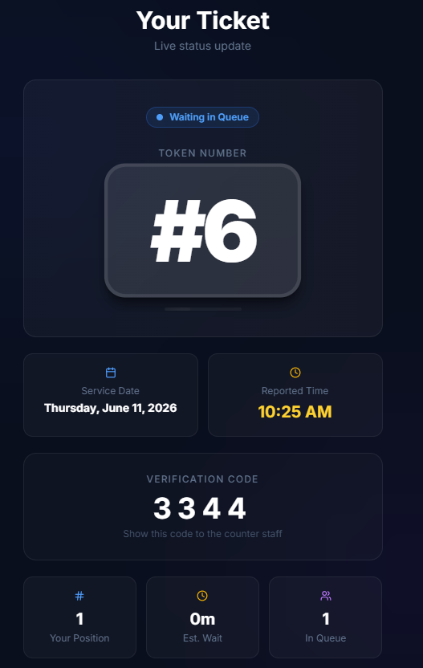

# Pālo: Smart Queue Management

## 📋 Project Information
- **Team Name**: PCAS
- **Members**:
  - Angel Mainali
  - Stuti Bagale Thapa
  - Uday Kumar Dev

## 🚨 Problem Statement
Physical queues in government offices, hospitals, and busy service centers lead to extreme time wastage, overcrowding, and a poor service experience. Citizens often wait for hours without any visibility into their actual turn time, leading to frustration and inefficiency.

## ✅ Solution Description
Pālo (पालो - "Your Turn") is a premium, real-time queue management system designed to eliminate physical waiting. It combines a stunning "Vanguard" glassmorphism aesthetic with powerful logic to provide:
- **Digital Registration**: Join the queue remotely and nominate priority (Critical, Urgent, Normal).
- **AI-Powered Predictions**: A Machine Learning engine predicts wait times based on live queue depth and history.
- **Triage & Priority**: A dynamic scoring system ensures emergency cases are served first while preventing starvation for normal users.
- **Automated SMS Updates**: Integration with Infobip for booking confirmations and "turn is near" reminders.

## 🛠️ Tech Stack Used
- **Frontend**: React (Vite), Tailwind CSS, Lucide-React, Framer Motion.
- **Backend**: FastAPI (Python), SQLAlchemy (SQLite).
- **Machine Learning**: Scikit-Learn (Gradient Boosting Regressor), NumPy.
- **APIs**: Infobip SMS API.

## ⚙️ Setup / Installation Instructions

### Backend Setup
1. Open a terminal in the `backend` directory.
2. Initialize a virtual environment: `python -m venv venv`.
3. Activate the environment: `.\venv\Scripts\activate` (Windows) or `source venv/bin/activate` (Mac/Linux).
4. Install dependencies: `pip install -r requirements.txt`.
5. Run the server: `uvicorn main:app --reload --port 8000`.

### Frontend Setup
1. Open a terminal in the `frontend` directory.
2. Install dependencies: `npm install`.
3. Start the development server: `npm run dev`.

## 🤖 AI Tools Used
- **Antigravity (Google DeepMind)**: Antigravity was used extensively for:
  - Designing and implementing the "Vanguard" Glassmorphism UI.
  - Architecting the Priority Scoring and Anti-Starvation algorithms.
  - Building the ML-based wait time prediction engine.
  - Synchronizing the system-wide Nepal Standard Time (NPT) logic.
  - Rapid debugging and refactoring of complex state management.

## 📸 Demo & Screenshots
*(Screenshots representing the User Portal and Admin Dashboard)*

---

**Pālo** · Smart. Simple. Fast.
